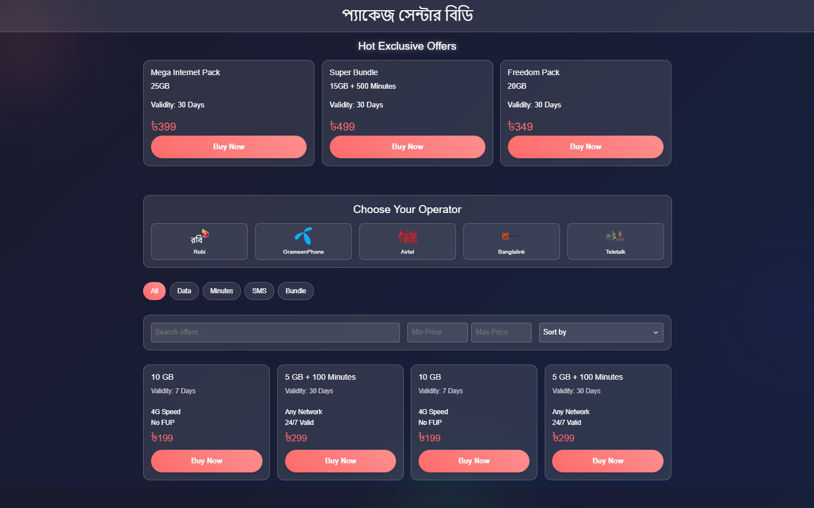
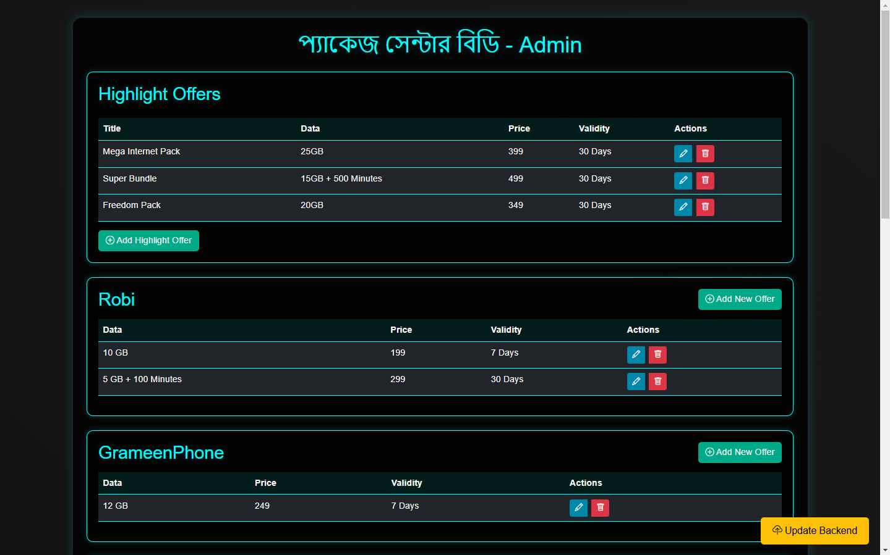
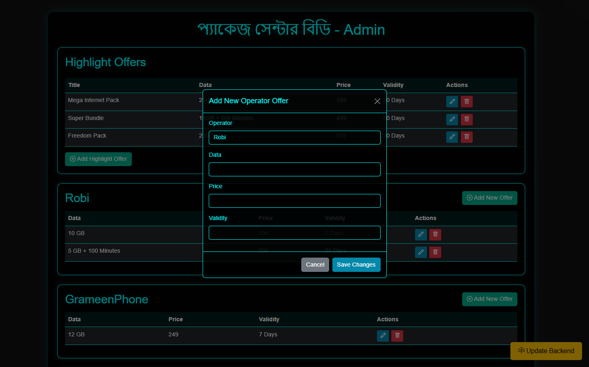
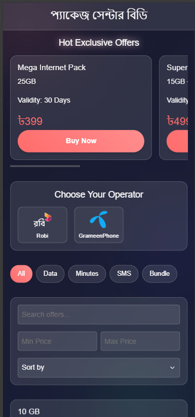
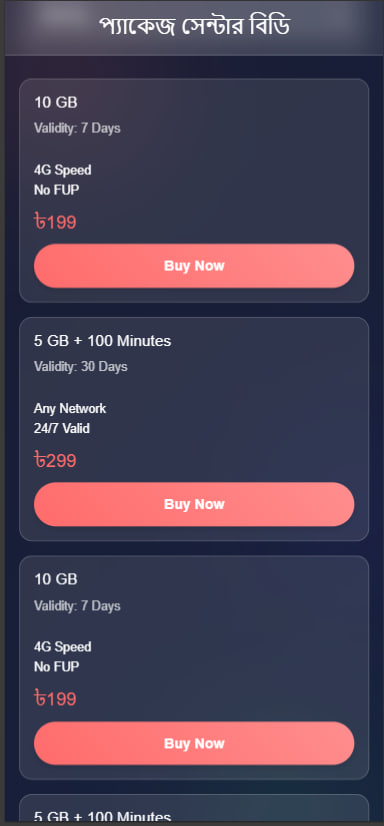
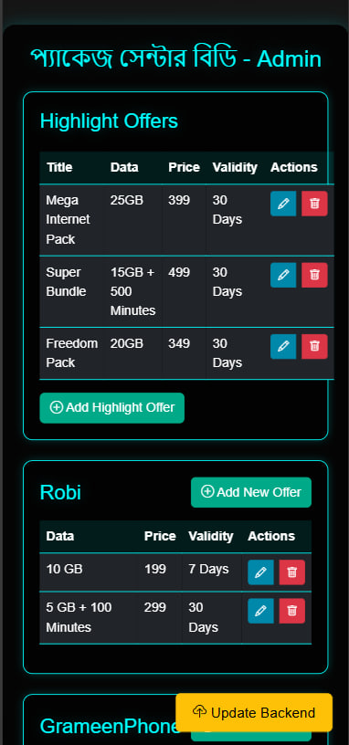
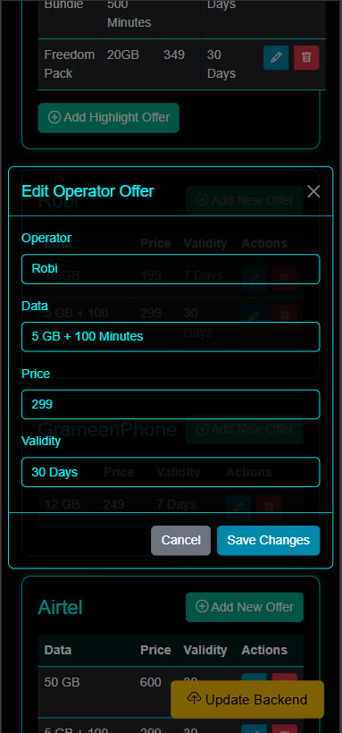

#  প্যাকেজ সেন্টার বিডি

"প্যাকেজ সেন্টার বিডি" A comprehensive website for various offers and packages from Bangladeshi SIM operators.

## Features

- View various offers and packages from different Bangladeshi SIM operators.
- User-friendly interface to browse and compare packages.
- Regular updates with the latest offers.
- Filter packages by type (Data, Minutes, SMS, Bundle).
- Search and sort packages by price.
- Copy offer details to clipboard.
- Share offers via WhatsApp.
- Admin panel for managing offers.

## Installation

1. Clone the repository:
   ```bash
   git clone https://github.com/tas33n/Package-Center-BD.git
   ```
2. Navigate to the project directory:
   ```bash
   cd Package-Center-BD
   ```

## Usage

1. Open the `index.html` file in your web browser to view the website.
2. For admin functionalities, open the `admin.html` file in your web browser.

## Image Previews

Here are some previews of the website:

# Home Page (Desktop)

<div style="max-width: 100%; height: auto; overflow: hidden;">
  
</div>

# Admin Page (Desktop)

<div style="max-width: 100%; height: auto; overflow: hidden;">
  
</div>

# Admin Edit/Add Page (Desktop)

<div style="max-width: 100%; height: auto; overflow: hidden;">
  
</div>

# Home Page (Mobile)

<div style="max-width: 100%; height: auto; overflow: hidden;">
  
    
</div>

# Admin Page (Mobile)

<div style="max-width: 100%; height: auto; overflow: hidden;">
  
   
</div>

## Contributing

Contributions are welcome! Please follow these steps:

1. Fork the repository.
2. Create a new branch:
   ```bash
   git checkout -b feature-branch
   ```
3. Make your changes and commit them:
   ```bash
   git commit -m "Description of changes"
   ```
4. Push to the branch:
   ```bash
   git push origin feature-branch
   ```
5. Create a pull request.

## License

This project is licensed under the MIT License. See the [LICENSE](LICENSE) file for more details.
